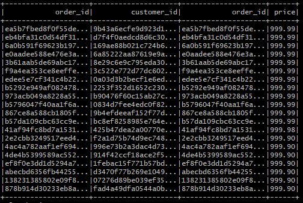
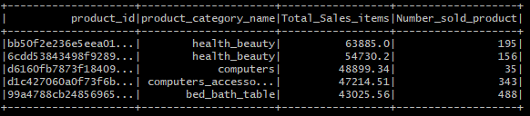
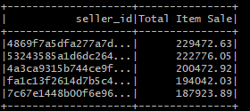
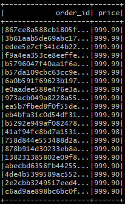

# TechnicalTest

# RUN

## First up all the containers with docker-compsose: 

docker-compose up --build
## Then go inside the spark master container:
docker exec -it spark-master bash
## Execute The Spark Jar application With the Command Bellow:

cd bin && /usr/bin/spark-3.0.0-bin-hadoop3.2/bin/spark-submit --master spark://spark-master:7077 /opt/spark-technical-test_2.13-0.1.jar --class JobFreeToMove --driver-memory 1G --executor-memory 1G
## Cron Script to run the Spark app every 24h

### Access to the WebUI

| Application     | URL                                      
| --------------- | ----------------------------------------
| Spark_master    | localhost:8080                           
| Spark-worker-1  | localhost:8081                        
| Spark-worker-2  | localhost:8082                      

# Statisctic

## Best Customers

##  Best Products

## Best Sellers

## Best Orders

